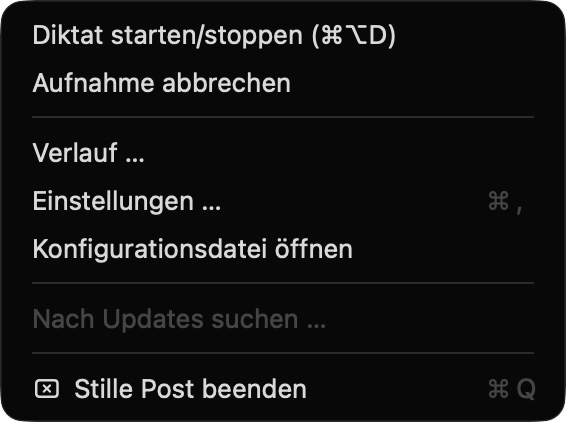
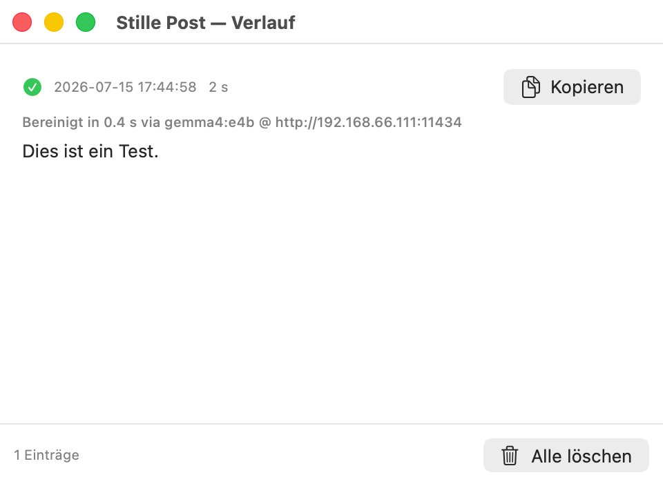
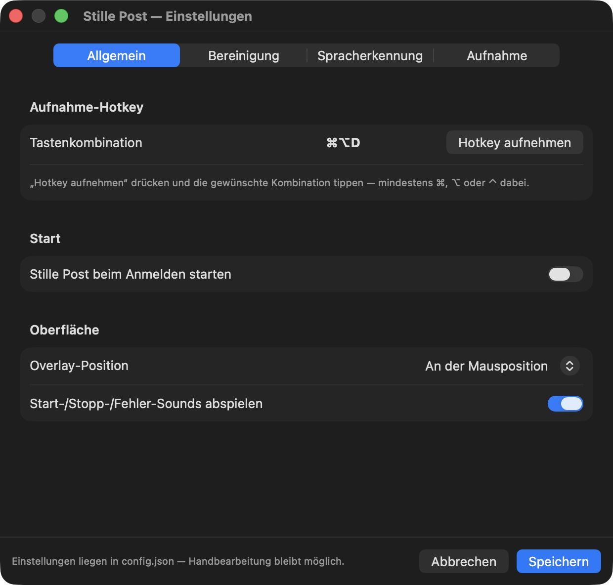
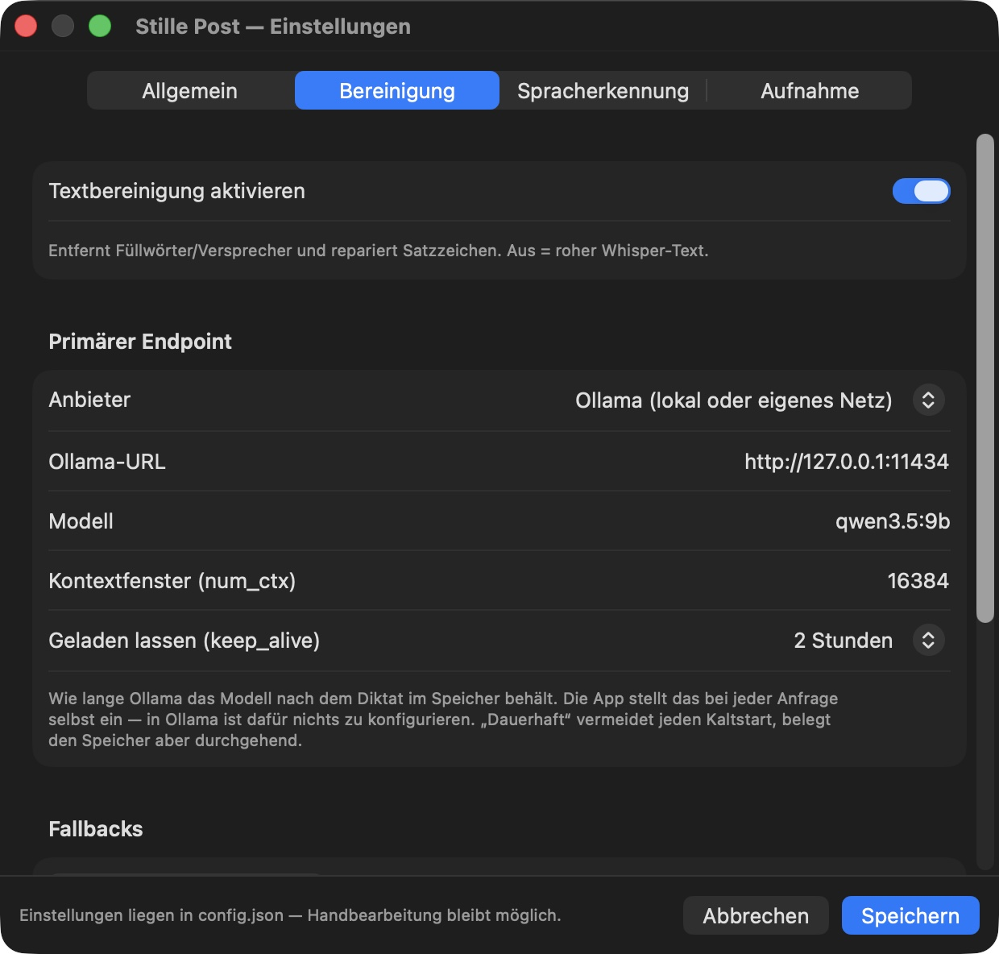
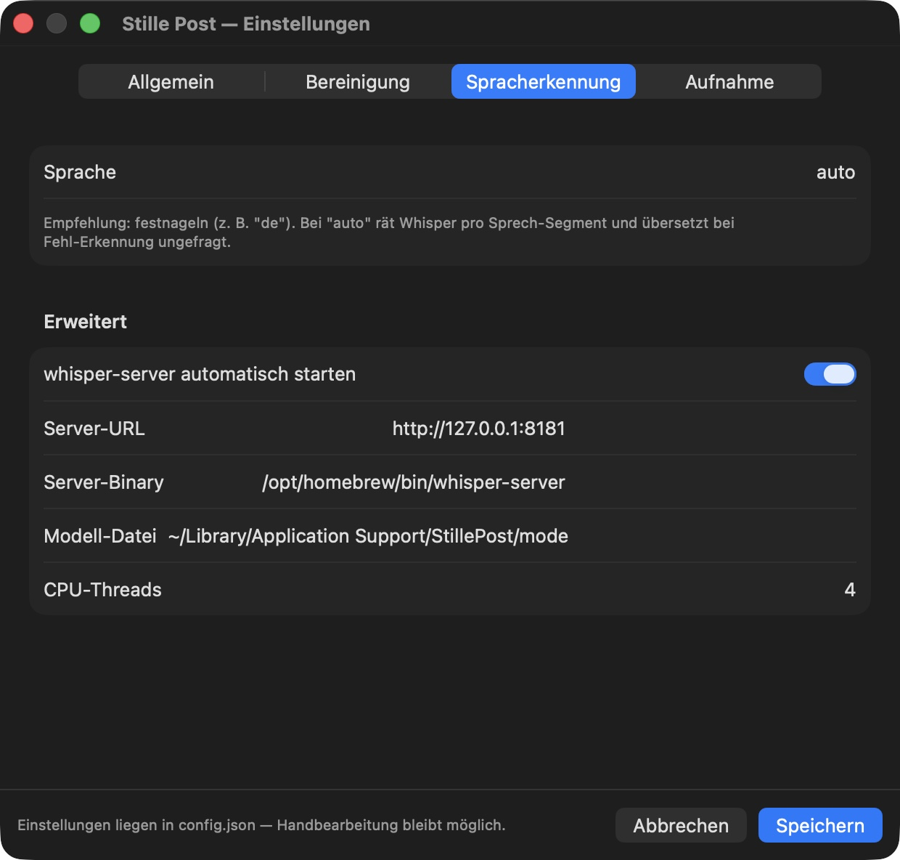
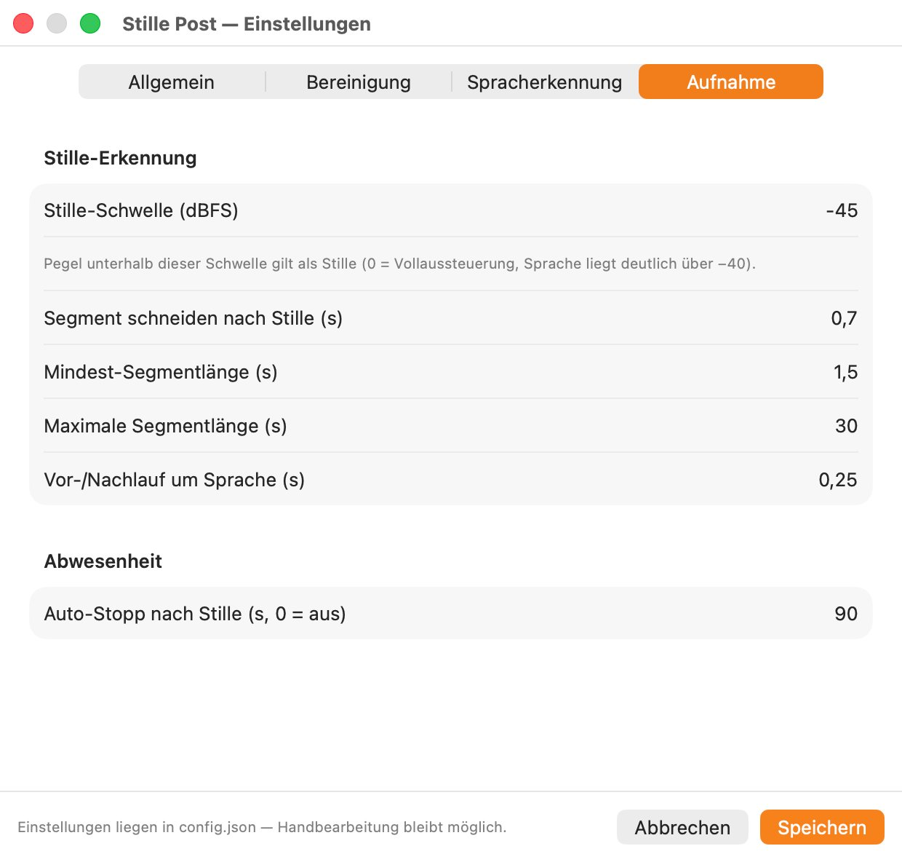

# Stille Post

**🌐 Sprache / Language:** [English](README.md) · [Deutsch](README.de.md)

Local dictation app for macOS: Global hotkey, speech-to-text with Whisper, and text
cleanup with a local language model. The finished text lands right at your cursor.
Recordings never leave your machine.

Yes, this is probably the millionth Whisper dictation clone. The difference is the
bar it aims for: **No noticeable wait** after you stop speaking (even for long
dictations) and a cleanup stage that **cleans instead of rewriting**. Typical
dictation tools start processing only after you finish talking, and their cleanup
models paraphrase, shorten, or even "answer" your dictation. Both failure modes are
designed out here.

## How the wait disappears

Stille Post processes audio **while** you speak: A voice-activity detector cuts the
recording stream into segments at natural pauses, and each finished segment is
transcribed immediately, in parallel with the ongoing recording. When you stop,
speech recognition is essentially done; what remains is the text cleanup, which
deliberately runs **once over the whole dictation**. Only with full context can the
model punctuate correctly instead of leaving a spurious period at every pause. The
cleanup model is also pre-warmed when recording **starts**, so no model cold-start
ever lands in your wait time.

## How cleanup stays honest

1. A strict, example-backed system prompt: Remove filler words, false starts,
   stutters and duplications only; never paraphrase, never summarize, never answer
   questions contained in the dictation.
2. A **post-model sanity check**: if the cleaned version deviates strongly from the
   raw transcript in length (a telltale sign of shortening, inventing, or
   "answering"), the raw transcript is used automatically and the history entry is
   flagged. Cleanup can never destroy a dictation.
3. If cleanup fails entirely, the raw transcript is pasted, never nothing.
4. **Deviations are visible:** The overlay shows when cleanup switches to a backup
   endpoint or when the raw transcript was pasted; the history records the endpoint
   used and the cleanup duration for every dictation.

## Features

- **Global hotkey** (default ⌘⌥D, configurable) to start/stop recording.
- **Unmissable recording indicator:** A large red overlay at the mouse position
  (still visible when macOS screen zoom is active, since zoom follows the cursor)
  with a **live microphone level meter**, so you can see that audio is actually
  arriving. Plus clearly distinct start/stop/error sounds and a red menu bar icon.
- **Silence detection:** Pure silence is never sent to Whisper (no hallucinations
  during thinking pauses); after prolonged absence the recording stops automatically.
- **History window:** View and copy all dictations (including the raw transcript
  before cleanup), delete everything with one click.
- **Recordings are deleted immediately after successful transcription.** Only failed
  transcriptions keep their audio so you can hit "Retranscribe" in the history.
  Once it succeeds, the audio is deleted as well.
- **Automatic microphone selection:** Always uses the system default input device.
- **Privacy:** Speech recognition and cleanup run fully local. Optionally, cleanup
  can be delegated to any OpenAI-compatible provider. In that case only the
  transcribed **text** is sent, never audio.

## Menu bar & history

| | |
|:---:|:---:|
|  |  |
| *Menu bar: start/stop, history, settings, quit* | *History: every dictation (raw + cleaned), copy with one click* |

## Scriptable without the GUI (scripts & AI agents)

The entire pipeline is usable headless, with the same logic and configuration:

```bash
stillepost-cli doctor                  # check dependencies (exit code 0 = ready)
stillepost-cli install-model           # fetch the Whisper model (resumable)
stillepost-cli transcribe file.wav     # WAV -> cleaned text on stdout
stillepost-cli transcribe file.wav --raw
stillepost-cli cleanup "raw text"      # cleanup only ("-" reads stdin)
stillepost-cli history list --json     # machine-readable history
stillepost-cli history clear
stillepost-cli set-cleanup-key         # API key for cloud cleanup (reads stdin)
```

Diagnostics go to stderr, results to stdout, failures exit non-zero. Built for
pipes and automation. The `STILLEPOST_CONFIG` environment variable points to an
alternative config file (e.g. for tests).

The CLI ships inside the app bundle and is not on your PATH by default. Link it once:

```bash
sudo ln -sf /Applications/StillePost.app/Contents/MacOS/stillepost-cli \
            /usr/local/bin/stillepost-cli
```

Without the link, the full path works too:
`/Applications/StillePost.app/Contents/MacOS/stillepost-cli doctor`

## Installation

Requirements: macOS 14+, [Homebrew](https://brew.sh), [Ollama](https://ollama.com).

```bash
brew install whisper-cpp          # local Whisper server (whisper.cpp)
ollama pull qwen3.5:9b            # default cleanup model (~6 GB loaded — a sensible
                                  # compromise, comfortable on 16–32 GB Macs)
# Want higher quality and have the RAM to spare? gemma4:26b (~18 GB loaded, needs a
# 32 GB+ Mac) is noticeably stronger; select it via config.json/settings.
scripts/build-app.sh --install    # builds the app and installs it to /Applications
open /Applications/StillePost.app
```

The Whisper model is **not** in that list on purpose: the app offers to download it
on first launch if it is missing (`large-v3-turbo`, ~1.6 GB) and shows progress.
Prefer to do it yourself, or scripting a machine?

```bash
scripts/install-model.sh                # straight from the repo, needs nothing else
scripts/install-model.sh large-v3       # the only alternative (~3.1 GB), see below

# or via the CLI (for its path, see "Scriptable without the GUI"):
stillepost-cli install-model
```

Both routes resume interrupted downloads and verify completeness — at 1.6 GB you do
not want to start over.

Being honest about what is left: `brew install whisper-cpp` above is the **one
remaining manual prerequisite**. Stille Post fetches its own model, but it does not
install the whisper.cpp server for you — it will not reach into your package manager.
`stillepost-cli doctor` tells you if it is missing.

On first launch macOS asks for two permissions: **Microphone** (recording) and
**Accessibility** (pasting at the cursor via simulated ⌘V).

### Which Whisper model?

Two, deliberately — a long model list would only shift the decision onto you:

| Model | Size | When |
|---|---|---|
| `large-v3-turbo` | ~1.6 GB | **Default.** Best mix of quality and speed. |
| `large-v3` | ~3.1 GB | Only if foreign words and jargon have to land better. Slower. |

Smaller models are not offered: worse recognition is not a trade anyone wants, and
turbo is not that big.

## Configuration

All settings are available as a dialog in the menu bar menu under **"Einstellungen …"**
(Settings). Underneath lives `~/Library/Application Support/StillePost/config.json`
(created on first launch, menu item "Konfigurationsdatei öffnen"). The file stays
hand-editable.

The dialog is organized into four tabs, so the common cases never require editing
JSON (the cleanup model shown is just an example, not a recommendation):

| | |
|:---:|:---:|
|  |  |
| *General — recording hotkey & overlay* | *Cleanup — provider, model, context, fallbacks* |
|  |  |
| *Speech recognition — language & Whisper server* | *Recording — silence detection & auto-stop* |

The most important switches:

| Section | Field | Meaning |
|---|---|---|
| `hotkey` | `keyCode`, `modifiers` | recording hotkey (default ⌘⌥D). In the General tab, "Hotkey aufnehmen" records the combination you press — no need to look up key codes |
| `whisper` | `language` | `"auto"` or fixed, e.g. `"de"`. **Recommendation: Pin it.** With `auto`, Whisper guesses the language per speech segment and silently translates on misdetection |
| `cleanup` | `enabled` | cleanup on/off |
| `cleanup` | `provider` | `"ollama"` (local/own network) or `"openai"` (cloud, text only) |
| `cleanup` | `model` | Ollama model name |
| `cleanup` | `ollamaURL` | Ollama endpoint; may also be another machine on your own network |
| `cleanup` | `keepAlive` | how long Ollama keeps the model in memory after a dictation: `"2h"` (default), `"20m"`, `"0"` (unload at once) or `"-1"` (never unload). Sent with every request — nothing to configure in Ollama |
| `cleanup.remote` | `baseURL`, `model` | OpenAI-compatible provider |
| `cleanup` | `fallbacks` | backup endpoints tried when the primary does not respond (see below) |
| `vad` | `autoStopAfterSilenceSec` | absence auto-stop (0 = off) |
| `ui` | `overlayPosition` | `"mouse"` or `"bottomCenter"` |

Setting up cloud cleanup (example; works with any OpenAI-compatible provider):

```jsonc
"cleanup": {
  "provider": "openai",
  "remote": { "baseURL": "https://api.example.com/v1", "model": "model-name" }
}
```

The API key does **not** go into the file. Store it in the keychain
(`stillepost-cli set-cleanup-key`) or in the `STILLEPOST_CLEANUP_API_KEY`
environment variable.

### Cleanup on a stronger machine (with fallback)

On a weaker laptop it pays off to hand cleanup to a stronger machine on your own
network: There you can run the bigger, higher-quality model (e.g. gemma4:26b) while
the laptop keeps the ~6 GB of RAM for its lightweight local fallback.

**On the strong machine** (the one that serves — it does not need Stille Post):

1. Pull the model: `ollama pull gemma4:26b`
2. Make Ollama listen on the network interface, not just on localhost: set
   `OLLAMA_HOST=0.0.0.0`, or use "Expose Ollama to the network" in the Ollama app.
3. Check from another Mac: `curl http://<ip-of-the-strong-mac>:11434/api/version`

That is all — model, context size and keep-alive are sent by Stille Post with every
request, so there is nothing else to set up in Ollama.

**On every Mac you dictate on:** install Stille Post, then open Settings → Cleanup
and enter the strong machine's endpoint (`http://<ip>:11434`), the model and, if you
like, a keep-alive. `stillepost-cli doctor` checks the whole chain and tells you
whether the endpoint answers and the model is present.

**How long the model stays loaded** is the "keep_alive" dropdown in the same tab.
The default of 2 hours is a compromise: dictate again within that window and the
model answers instantly; after that Ollama frees the RAM by itself. "Permanently"
never lets go — the right choice if you have RAM to spare. The wait rarely shows
either way, because Stille Post starts warming the model the moment you press the
hotkey: it loads while you are still speaking.

`fallbacks` lists backup endpoints tried in order when the primary does not respond
(probe timeout 2 s; away from your home network, local Ollama takes over almost
without delay):

```jsonc
"cleanup": {
  "ollamaURL": "http://192.168.1.50:11434",   // strong machine on the LAN (primary)
  "model": "gemma4:26b",
  "keepAlive": "2h",                          // "-1" = keep loaded forever
  "fallbacks": [
    { "provider": "ollama", "ollamaURL": "http://127.0.0.1:11434", "model": "qwen3.5:9b" },
    { "provider": "openai", "remote": { "baseURL": "https://api.example.com/v1", "model": "model-name" } }
  ]
}
```

Only transcribed TEXT travels over your network, never audio — speech recognition
always runs on the machine you dictate on. Which endpoint handled a cleanup is shown
by `stillepost-cli cleanup` and in the history window.

## Development & tests

```bash
swift test            # unit tests (VAD, WAV, sanity check, history …)
scripts/e2e-test.sh   # end to end: say voice -> Whisper -> cleanup -> assertions
```

## Status

Early, but usable. Planned: A comparison benchmark (quality and latency) against
other local dictation tools and cloud services.
